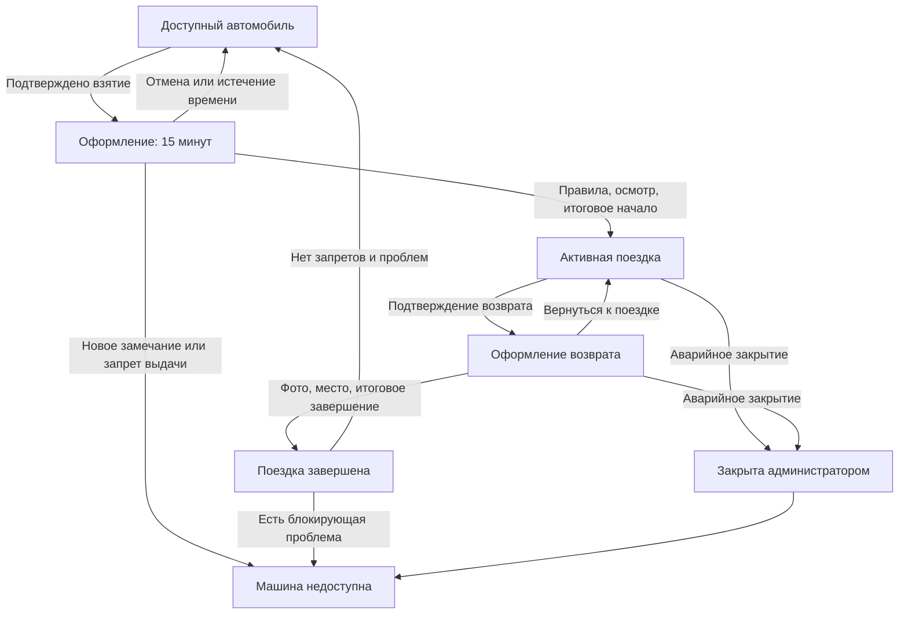

# Корпоративный автопарк в MAX — функциональная спецификация MVP

Версия: 1.1. Дата: 26.09.2026.

Адаптация к репозиторию: пользовательские сценарии версии 1.0 сохранены. Уточнены стек карты и порядок независимой разработки Go/Python с последующей интеграцией. Решения и допущения — в [архитектуре](docs/ARCHITECTURE.md), рабочий план команды — в [плане реализации](docs/IMPLEMENTATION_PLAN.md).

Назначение: единое описание продукта для команды, разработчиков, QA и ИИ-агентов. Документ описывает требуемое поведение; перечисленные возможности ещё не реализованы и не проверены на устройствах.

## 1. Цель и границы продукта

Сотрудник находит свободную служебную машину, фиксирует её состояние, начинает поездку и возвращает автомобиль с фотографиями и точкой парковки. Ответственный за автопарк видит, кто использует машины, где их оставили и какие замечания требуют проверки.

Исходные условия:

- Одна компания, около 10 легковых автомобилей без закреплённых водителей.
- Две роли: сотрудник и администратор автопарка.
- Основной интерфейс — личный чат с ботом MAX и inline-кнопки.
- Для выбора произвольной точки парковки используется небольшой экран карты в мини-приложении MAX.
- Автомобиль можно оставить в произвольном допустимом месте. Фиксированные парковки компании не являются обязательным условием возврата.
- Срок реализации MVP: 3–4 дня.
- Предполагаемая архитектура: Go — интеграция с MAX и диалоги; Python — правила автопарка, данные и внутренний API; PostgreSQL — хранение данных.

Принятые в этой спецификации проектные предложения: 8 обязательных фотографий на каждый осмотр; временное закрепление машины на 15 минут; 4 варианта ответа в математической проверке; уровни топлива с шагом 25%. Это рабочие значения для разработки, предложенные на основе обсуждения, а не подтверждённый регламент компании.

## 2. Объём MVP

| Приоритет | Функциональность |
|---|---|
| P0 — обязательно | Доступ сотрудников, главное меню, список свободных машин, карточка машины |
| P0 | Взятие автомобиля: подтверждение, математическая проверка, правила, осмотр, начало поездки |
| P0 | Активная поездка, сообщение о проблеме, возврат с осмотром и точкой парковки |
| P0 | Карта с ручным выбором точки, работающая без разрешения на геолокацию |
| P0 | История своих поездок и просмотр собственных фотографий |
| P0 | Меню администратора: машины, активные поездки, история, сотрудники, замечания |
| P0 | Уведомления о начале/завершении поездки и новых проблемах |
| P0 | Блокировка выдачи машины, управление доступом сотрудника, аварийное закрытие поездки администратором |
| P0 | Сохранение прогресса, защита от повторных нажатий и одновременного взятия одной машины |
| P1 — после рабочего P0 | Автоматическое определение текстового адреса по координатам |
| P1 | Добавление новых автомобилей через бот; для P0 достаточно начального заполнения данных |
| P1 | Экспорт истории, фильтры по произвольному диапазону дат, дополнительные отчёты |

За пределами MVP: бронирование на будущие даты, оплата, управление замками, GPS-трекинг во время движения, автоматическое распознавание повреждений, оценка виновности, интеграция с телематикой и управление несколькими компаниями.

## 3. Роли и доступ

### 3.1. Сотрудник

Может видеть доступные ему автомобили, оформлять одну поездку, сообщать о проблемах и просматривать только свои поездки. Не видит историю поездок других сотрудников.

### 3.2. Администратор автопарка

Видит все автомобили, поездки, осмотры, сотрудников и замечания компании. Управляет выдачей машин и доступом сотрудников. Может пользоваться сценарием сотрудника, если ему разрешено брать автомобили.

### 3.3. Первый вход

1. Пользователь открывает бота и нажимает «Старт».
2. Система определяет его по MAX user ID и проверяет запись сотрудника.
3. Если доступ есть — показывает главное меню.
4. Если доступа нет — сообщает: «Доступ ещё не выдан. Передайте ответственному за автопарк ваш ID: …».
5. Администратор добавляет сотрудника по MAX user ID и ФИО. Самостоятельное получение роли администратора недоступно.

Первый администратор задаётся при настройке приложения. Для демонстрации заранее создаются сотрудники и автомобили. В P0 допущенный сотрудник может брать все доступные машины компании.

Блокировка сотрудника запрещает новые поездки. При наличии активной поездки ему сохраняется возможность сообщить о проблеме и завершить возврат.

## 4. Общие правила

| ID | Правило |
|---|---|
| BR-01 | У сотрудника не более одной активной поездки или незавершённого оформления взятия машины |
| BR-02 | Одна машина одновременно закреплена только за одним сотрудником |
| BR-03 | Просмотр карточки и нажатие первой кнопки «Взять машину» ещё не начинают поездку |
| BR-04 | После подтверждения намерения взять машину она временно закрепляется за сотрудником на 15 минут |
| BR-05 | Начало и окончание поездки происходят только после успешного сохранения всех обязательных данных |
| BR-06 | Во время оформления возврата машина продолжает числиться за сотрудником |
| BR-07 | Закрытие чата, перезапуск бота и переход в меню не отменяют поездку и не стирают сохранённый прогресс |
| BR-08 | Повторная доставка одного события или повторное нажатие кнопки не создаёт вторую поездку, фотографию или операцию возврата |
| BR-09 | Сервер проверяет пользователя, права, текущий шаг и актуальное состояние машины при каждом изменении |
| BR-10 | После завершения поездки её осмотры и фотографии доступны только для чтения; исправления администратора записываются отдельно |
| BR-11 | Необходимое количество фотографий: ровно 8 до поездки и ровно 8 после неё. Дополнительные фото проблем хранятся отдельно |
| BR-12 | Местоположение в карточке — последняя подтверждённая точка парковки с датой, а не текущий GPS автомобиля |
| BR-13 | Уровень топлива и пробег вводит сотрудник. Автоматического чтения приборов и данных машины в MVP нет |
| BR-14 | Фотографии помогают сравнить состояние. Система сама не устанавливает, кто причинил повреждение |

Все даты фиксирует сервер. В интерфейсе используется часовой пояс компании, в хранилище — UTC.

## 5. Главное меню сотрудника

Без активной поездки:

- «Доступные автомобили».
- «Мои поездки».
- «Правила и помощь».

При незавершённом взятии машины дополнительно отображается «Продолжить оформление».

При активной поездке первой отображается «Текущая поездка». Взять другую машину нельзя. Администратору дополнительно доступна кнопка «Управление автопарком».

Команды `/start` и `/menu` возвращают в меню без сброса состояния. На экранах предусмотрены кнопки «Назад» и «В меню». Отмена операции — отдельное явно названное действие.

## 6. Список автомобилей и карточка

### 6.1. Доступные автомобили

Каждый автомобиль представлен отдельной кнопкой: «А123ВС77 · Kia Rio».

- На странице до 5 автомобилей; при необходимости есть «Далее» и «Назад».
- Адрес, топливо и подробности показываются после выбора машины.
- Список содержит только автомобили, которые сейчас можно взять.
- Есть кнопка «Обновить».
- Если свободных машин нет: «Сейчас нет доступных автомобилей. Попробуйте обновить список позже».

Старая кнопка из предыдущего сообщения не гарантирует доступность: состояние повторно проверяется при открытии и подтверждении взятия.

### 6.2. Карточка автомобиля

Обязательные поля:

| Поле | Отображение |
|---|---|
| Автомобиль | Марка, модель, госномер |
| Статус | Доступен / оформляется / в поездке / недоступен |
| Место парковки | Точка на карте; текстовый адрес, если получен; ориентир, если указан |
| Актуальность места | Дата и время последнего подтверждения |
| Топливо | Последний заявленный уровень и время обновления |
| Пробег | Последнее значение одометра и время обновления |
| Описание | Например, коробка передач, особенности автомобиля |
| Известные замечания | Зафиксированные и разрешённые администратором неблокирующие замечания |
| Ключи | Где получить и куда вернуть физический ключ |

Кнопки: «Взять машину», «Показать на карте», «Предыдущий осмотр», «Назад».

«Предыдущий осмотр» показывает состояние машины при последнем возврате без раскрытия сотруднику истории чужих поездок и ФИО предыдущего водителя. Если осмотра ещё не было, это явно указано.

Если координат или сведений о топливе ещё нет, показывается «Не указано». Начальные значения администратор заполняет до выдачи машины; неизвестный пробег/топливо уточняет сотрудник при первом осмотре. Машина без понятного места и инструкции получения ключа не публикуется как доступная.

Над кнопкой взятия: «Начинайте оформление, когда вы рядом с автомобилем». Само нажатие не доказывает физическое присутствие.

## 7. Взятие автомобиля: пошаговый сценарий

### TAKE-01. Намерение

Сотрудник нажимает «Взять машину».

Бот: «Вы рядом с Kia Rio, А123ВС77, и хотите оформить поездку?».

Кнопки: «Да, оформить» / «Отмена».

При подтверждении сервер одновременно проверяет право сотрудника и доступность машины, создаёт оформление и закрепляет автомобиль на 15 минут. Другой сотрудник уже не может начать оформление этой машины.

Если машину успели занять: «Этот автомобиль уже недоступен. Выберите другой».

### TAKE-02. Проверка намерения

Бот показывает простой пример, например «Сколько будет 3 + 4?», и 4 кнопки с вариантами ответа. До правильного ответа следующий шаг недоступен. Подробные правила проверки приведены в разделе 14.

### TAKE-03. Правила использования

Сотрудник видит короткий текст правил компании:

- Использовать автомобиль в согласованных служебных целях.
- Соблюдать правила эксплуатации и парковки.
- Не передавать автомобиль другому человеку без согласования.
- Зафиксировать состояние до выезда и после поездки.
- Сообщать о повреждениях, неисправностях и загрязнении.
- Вернуть ключи установленным способом.

Кнопки: «Принимаю правила» / «Отменить оформление».

Сохраняются пользователь, версия текста правил и время принятия. Точный текст утверждает компания; перечисленные пункты — содержание для прототипа.

### TAKE-04. Осмотр до поездки

1. Бот показывает известные замечания по машине.
2. Сотрудник подтверждает фактический уровень топлива: «0%», «25%», «50%», «75%», «100%». Значения приблизительные.
3. Сотрудник вводит показание одометра в километрах. Оно не может быть отрицательным или меньше предыдущего подтверждённого значения. При расхождении доступна связь с администратором.
4. Сотрудник отправляет 8 фотографий по ракурсам из раздела 9.
5. Бот спрашивает: «Есть новые повреждения, неисправности или загрязнение, которых нет в списке замечаний?».

Ответы: «Новых замечаний нет» / «Есть замечание».

При новом замечании сотрудник выбирает категорию, пишет краткое описание и при необходимости прикладывает до 3 дополнительных фото. Машина становится недоступной до проверки администратора, оформление отменяется. Сотруднику предлагается выбрать другую машину. Осмотр и замечание сохраняются.

Это консервативное правило MVP: сотрудник не должен сам решать, можно ли выдать машину с новым повреждением.

### TAKE-05. Проверка данных и начало

Сводка перед началом:

> Kia Rio · А123ВС77. Фото: 8/8. Топливо: 50%. Пробег: 42 150 км. Новых замечаний нет. Правила приняты.

Подтверждение: «Подтверждаю, что фотографии относятся к этой машине и показывают её состояние сейчас».

Кнопки: «Подтвердить и начать поездку» / «Исправить данные» / «Отменить оформление».

После успешного сохранения:

- создаётся поездка и фиксируется время начала;
- осмотр связывается с поездкой;
- автомобиль получает статус «В поездке»;
- сотрудник видит номер поездки и кнопку «Текущая поездка»;
- администратору отправляется уведомление.

До этого ответа бот не сообщает, что поездка началась. Физическая выдача ключа выполняется по процедуре компании; приложение замки автомобиля не открывает.

### TAKE-06. Отмена и истечение времени

- Явная отмена освобождает закрепление после подтверждения «Отменить оформление?».
- По истечении 15 минут закрепление освобождается, если поездка ещё не началась.
- Уже загруженные данные остаются в истории попытки, но не считаются начатой поездкой.
- После истечения времени требуется новое оформление и новые фотографии: старый осмотр нельзя автоматически использовать для другой выдачи.
- До истечения времени повторный вход продолжает оформление с сохранённого шага.
- Если администратор заблокировал автомобиль, начать поездку нельзя даже из уже открытого оформления.

## 8. Активная поездка

Карточка содержит автомобиль, номер поездки, время начала, длительность и кнопку просмотра осмотра до выезда.

Кнопки:

- «Завершить поездку».
- «Сообщить о проблеме».
- «Связаться с ответственным».
- «В меню».

Сообщение о проблеме: категория → описание → до 3 фото по желанию → сводка → «Отправить».

Категории: повреждение кузова, неисправность, загрязнение, проблема с ключами, другое.

Сообщение немедленно становится доступно администратору. Поездка остаётся активной. Автомобиль получает запрет следующей выдачи до разбора замечания. Если проблему заметили после предыдущего возврата, её также можно зарегистрировать из карточки автомобиля.

Бот не отслеживает движение. Карта во время поездки показывает последнюю зафиксированную парковку с соответствующей подписью.

## 9. Фотографии: единый стандарт до и после

Для каждого осмотра обязательны ровно 8 фотографий, по одной на каждый ракурс.

| № | Ракурс | Что должно быть видно |
|---|---|---|
| 1 | Спереди | Передняя часть целиком, бампер, фары, госномер |
| 2 | Сзади | Задняя часть целиком, бампер, фонари, госномер |
| 3 | Левый борт | Борт целиком, двери, крылья и колёса |
| 4 | Правый борт | Борт целиком, двери, крылья и колёса |
| 5 | Передняя часть салона | Передние сиденья, пространство ног, видимый мусор и загрязнение |
| 6 | Задняя часть салона | Задние сиденья и пространство ног |
| 7 | Багажник | Открытый багажник, пол и оставленные предметы |
| 8 | Приборная панель | Показания одометра и уровня топлива |

### 9.1. Загрузка

Чтобы не перепутать ракурсы, бот запрашивает их последовательно: «Фото 1/8 — автомобиль спереди». Пользователь отправляет одну фотографию. После её сохранения бот переходит к следующему ракурсу.

- Засчитываются изображения; текст, видео и документы не увеличивают счётчик.
- Если в одном сообщении прислано несколько изображений, они не распределяются по ракурсам автоматически. Бот просит отправить одно фото для текущего ракурса. Обработка сообщений одного сотрудника выполняется последовательно, чтобы параллельные события не перезаписали один ракурс.
- После 8 фото появляется сводка «8/8» и кнопки «Подтвердить фотографии» / «Заменить фотографию».
- Для замены пользователь выбирает ракурс и отправляет новое изображение. Остальные 7 фотографий сохраняются.
- Девятое изображение не добавляется к обязательному набору: бот предлагает заменить ракурс или прикрепить фото к замечанию.
- При нажатии подтверждения с неполным набором бот показывает недостающие ракурсы. Уже принятые фото повторно отправлять не требуется.
- Одинаковое событие MAX не засчитывается дважды. Полностью одинаковый файл внутри одного осмотра не принимается за разные ракурсы.
- Фото считается принятым после сохранения в хранилище, а не после простого получения ссылки от MAX.

Для P0 допустимы фотографии, отправленные из галереи. Бот не может гарантировать, что фото снято прямо сейчас и действительно показывает нужный ракурс. Это подтверждает сотрудник; администратор проверяет содержание при просмотре. Распознавание изображений не входит в MVP.

### 9.2. Хранение и сравнение

У каждого фото сохраняются осмотр, ракурс, автор, время получения и ссылка на сохранённый файл. Файлы хранятся отдельно от PostgreSQL; в БД — их метаданные.

При просмотре администратор выбирает ракурс и получает две фотографии с подписями «До» / «После». Для активной поездки доступна только фотография «До».

## 10. Возврат автомобиля: пошаговый сценарий

### RETURN-01. Начало возврата

Сотрудник открывает текущую поездку и нажимает «Завершить поездку».

Бот: «Вы припарковали А123ВС77 и готовы оформить возврат?».

Кнопки: «Да, оформить возврат» / «Продолжить поездку».

После подтверждения бот показывает математическую проверку. Поездка переходит в состояние оформления возврата, но её время продолжает идти и автомобиль остаётся занятым.

### RETURN-02. Состояние и условия возврата

Сотрудник последовательно указывает:

1. Новые повреждения или неисправности: «Нет» / «Есть».
2. Салон и багажник: «Чисто, мусор убран» / «Есть замечание».
3. Парковка: «Машина оставлена в допустимом месте и не мешает проезду» / «Есть проблема».
4. Один вопрос «Машина закрыта, ключи возвращены по правилам?» с четырьмя точными вариантами: «Закрыта, ключи возвращены», «Закрыта, ключи не возвращены», «Не закрывается, ключи возвращены», «Не закрывается, ключи не возвращены». Ответ записывает два отдельных факта: `keys_returned` и `car_locked`.
5. Уровень топлива: 0 / 25 / 50 / 75 / 100%.
6. Текущее показание одометра, не меньше показания при выезде.

При ответе «Есть» или «Есть проблема» появляется форма замечания. Нельзя требовать от сотрудника подтвердить исправность и чистоту вопреки фактическому состоянию.

Повреждение или загрязнение допускает завершение возврата с блокировкой последующей выдачи. Если сотрудник не может закрыть машину, вернуть ключи или оставить её в допустимом месте, самостоятельное завершение недоступно: сохраняется обращение администратору. Он организует решение и при необходимости применяет аварийное закрытие из раздела 13.6.

Открытые замечания, созданные во время поездки, также отображаются в анкете возврата. Ответ «Новых проблем нет» не закрывает их автоматически.

### RETURN-03. Осмотр после поездки

Сотрудник отправляет 8 фотографий тех же ракурсов и подтверждает комплект. Правила ошибок и замены совпадают с разделом 9.

### RETURN-04. Место парковки

Бот предлагает: «Укажите место, где оставили автомобиль».

Кнопки: «Отправить геопозицию» / «Выбрать точку на карте».

Сценарий выбора подробно описан в разделе 11. Место обязательно, кроме явно помеченного аварийного закрытия администратором.

### RETURN-05. Итоговое подтверждение

Сотрудник видит:

- автомобиль и время начала поездки;
- фотографии: 8/8;
- уровень топлива и одометр;
- выбранную точку парковки и ориентир, если указан;
- список замечаний или «Новых замечаний нет»;
- статус возврата ключей.

Текст подтверждения: «Подтверждаю фотографии, место парковки и указанные сведения о состоянии автомобиля».

Кнопки: «Подтвердить и завершить» / «Исправить данные» / «Вернуться к поездке».

После успешного сохранения одной операцией:

1. фиксируются время окончания и осмотр после поездки;
2. обновляются место, топливо и пробег машины;
3. поездка становится завершённой;
4. машина становится доступной, если нет блокирующих замечаний или запрета администратора;
5. иначе машина становится недоступной до проверки;
6. сотрудник получает подтверждение и ссылку на поездку в истории;
7. администратор получает уведомление.

При ошибке сохранения поездка остаётся незавершённой, а собранные данные сохраняются для повторной попытки.

### RETURN-06. Прерванный возврат

Закрытие приложения не завершает поездку. При следующем входе бот предлагает «Продолжить возврат».

Если сотрудник нажал «Вернуться к поездке», поездка снова активна. Старый черновик возврата сохраняется как отменённый; следующий возврат требует новых фотографий и новой точки, поскольку автомобиль мог перемещаться.

## 11. Геопозиция и карта

### 11.1. Штатная геопозиция MAX

Кнопка «Отправить геопозицию» использует `request_geo_location`. MAX поддерживает такую кнопку, однако конкретный интерфейс разрешения и отправки зависит от клиента. Бот не получает координаты автоматически без действия пользователя. [Документация MAX](https://dev.max.ru/docs-api/use-cases/sending-messages/keyboard).

После получения координат бот предлагает посмотреть точку и подтвердить: «Автомобиль оставлен здесь». Если координаты неточны, сотрудник выбирает «Изменить на карте».

Кнопка карты доступна сразу. Бот не обязан получать отдельное событие об отказе в разрешении: отсутствие координат не блокирует альтернативный путь.

### 11.2. Ручной выбор точки — обязательная часть P0

1. «Выбрать точку на карте» открывает небольшой экран внутри мини-приложения MAX.
2. Начальный центр — последняя парковка автомобиля, а если её нет, город компании. Это ориентир, он не считается выбранным местом.
3. Пользователь нажимает на карту или перемещает маркер.
4. Появляется кнопка «Автомобиль оставлен здесь».
5. По желанию пользователь выбирает «Уточнить место» и пишет ориентир: «За зданием, второй ряд, место 12». Это не обязательный ввод адреса.
6. После подтверждения координаты сохраняются в черновике возврата.
7. Бот показывает, что место принято, и позволяет перейти к итоговому подтверждению.

Ручной выбор работает без GPS и разрешения на геолокацию. Нельзя незаметно сохранять центр карты как место парковки.

Техническое взаимодействие: экран карты отправляет выбор в наш backend; backend проверяет пользователя и принадлежность поездки. Данные запуска мини-приложения проверяются сервером. Указанный клиентом ID сотрудника сам по себе не даёт права изменять поездку. [Валидация данных MAX](https://dev.max.ru/docs/webapps/validation).

### 11.3. Адрес и картографический сервис

Для P0 достаточно координат, маркера и кнопки открытия карты. Адрес вручную вводить не требуется. Если текстового адреса нет, карточка показывает «Место отмечено на карте» и ориентир, когда он указан.

Экран карты сохраняет стек репозитория: React + TypeScript + Vite, MAX UI и MAX Bridge. Внутри экрана используется Leaflet для карты и маркера; картографическая подложка подключается отдельно. [Leaflet](https://leafletjs.com/).

Для небольшого прототипа можно использовать стандартные тайлы OpenStreetMap с атрибуцией и соблюдением правил сервиса: обычная интерактивная загрузка, кеширование, без массового скачивания и офлайн-заготовок. У публичного сервиса нет гарантии доступности; источник тайлов задаётся настройкой. [Правила использования тайлов OpenStreetMap](https://operations.osmfoundation.org/policies/tiles/).

Автоматическое преобразование координат в адрес — отдельная функция P1. Ошибка получения адреса не должна мешать возврату. Автодополнение адреса и поиск организаций не требуются для P0.

### 11.4. Ошибки карты

- Отказ в доступе к геолокации: ручная установка маркера.
- Неточность GPS: изменение точки вручную.
- Карта не загрузилась: повторная попытка или отправка геопозиции штатной кнопкой MAX.
- Оба способа недоступны: сохраняется черновик и предлагается связь с администратором; координаты не подставляются автоматически.
- Координаты из старого или чужого оформления не принимаются.
- Уже выбранная точка не теряется при временном сбое отправки.

## 12. История сотрудника

«Мои поездки» показывает поездки от новых к старым, по 5 записей на странице.

Строка: дата, автомобиль, госномер, состояние поездки. Активная поездка отмечается отдельно.

Внутри поездки:

- номер, автомобиль, время начала/окончания, длительность;
- пробег и топливо при выезде и возврате;
- место возврата;
- фотографии до/после по ракурсам;
- замечания сотрудника и результат рассмотрения;
- отметка, если поездку закрыл администратор или данные неполные.

Завершённую поездку нельзя редактировать или удалять из пользовательского интерфейса. Незавершённые попытки взятия не смешиваются со списком состоявшихся поездок.

## 13. Администратор автопарка

### 13.1. Главное меню

Кнопки: «Активные поездки», «Автомобили», «История поездок», «Сотрудники», «Замечания», «В меню сотрудника».

На главном экране — количества: доступных автомобилей, автомобилей в поездках, оформлений взятия и машин, ожидающих проверки.

### 13.2. Активные поездки

Для каждой записи: сотрудник, автомобиль, время начала, длительность, состояние «В поездке» / «Оформляет возврат», наличие замечаний.

В карточке доступны осмотр до выезда, проблемы, контакт сотрудника и аварийное закрытие. Местоположение во время движения неизвестно; последняя парковка подписана как историческая.

### 13.3. Автомобили

Администратор видит все автомобили, включая недоступные, их последнее место и текущее использование.

Доступные действия P0:

- посмотреть карточку, последние осмотры и историю поездок;
- изменить описание и инструкцию по ключам;
- исправить место, топливо или одометр свободной машины с указанием причины;
- запретить выдачу автомобиля с обязательной причиной;
- вернуть автомобиль в доступные после проверки;
- открыть и обработать замечания.

Блокировка машины во время поездки не завершает её. Запрет действует на следующую выдачу. При блокировке во время оформления взятия оформление отменяется, сотрудник получает объяснение.

Разблокировка не разрешается при неразобранных блокирующих замечаниях. Администратор сначала фиксирует решение: проблема устранена либо замечание признано известным неблокирующим. Решение и автор сохраняются.

Одометр и место активной поездки не переписываются как будто получены от водителя. При необходимости администратор добавляет отдельное уточнение с автором и временем.

### 13.4. История всех поездок

Доступны общий список, выбор сотрудника и выбор автомобиля. Для P0 достаточно этих фильтров и сортировки по времени; произвольный диапазон дат — P1.

Карточка поездки содержит данные сотрудника и всю информацию из раздела 12. Осмотры сравниваются по одинаковым ракурсам. Автоматическая оценка повреждений отсутствует.

### 13.5. Сотрудники

Администратор может:

- просмотреть ФИО, MAX user ID, статус доступа и историю поездок;
- выдать доступ новому сотруднику по MAX user ID и ФИО;
- заблокировать или восстановить право новых поездок;
- увидеть текущую поездку сотрудника.

Выдача/отзыв роли администратора в P0 выполняются при настройке приложения. Удаление сотрудника вместе с историей через бот не предусмотрено.

### 13.6. Аварийное закрытие поездки

Применяется, когда обычный возврат невозможно закончить: потерян доступ к MAX, сломался телефон, машину забрал ответственный и т. п.

1. Администратор открывает конкретную активную поездку.
2. Нажимает «Закрыть поездку вручную».
3. Указывает обязательную причину и имеющиеся сведения о машине.
4. Видит сводку: водитель, госномер, номер поездки, какие данные отсутствуют.
5. Подтверждает действие и проходит математическую проверку.
6. Поездка закрывается с признаком `closed_by_admin`; время окончания — время операции, без скрытого изменения задним числом.
7. Машина становится недоступной до проверки даже при наличии фотографий.
8. Сотрудник получает уведомление с причиной.

Отсутствующие фотографии, ключи или координаты не подменяются фиктивными значениями. В истории явно видна неполнота данных. Возврат машины в доступные — отдельное действие администратора после проверки.

### 13.7. Замечания

Список содержит дату, автомобиль, автора, этап обнаружения, категорию и состояние рассмотрения.

Администратор открывает описание и фото, при наличии — сравнение с предыдущим осмотром. Действия: «Взять в работу», «Проблема устранена», «Известное неблокирующее замечание». Последние два требуют комментария и подтверждения.

Сообщение сотрудника сохраняется вместе с решением администратора. Повреждение не приписывается последнему водителю автоматически.

## 14. Подтверждения и математическая проверка

Назначение проверки — дополнительный шаг перед важной операцией. Она не заменяет права доступа и не подтверждает личность, трезвость или нахождение рядом с машиной.

| Действие | Требуемое подтверждение |
|---|---|
| Просмотр, навигация, открытие карты | Без подтверждения |
| Взятие машины | Подтверждение намерения → пример → правила/осмотр → итоговое начало |
| Возврат машины | Подтверждение намерения → пример → анкета/осмотр/место → итоговое завершение |
| Отмена оформления | Кнопка с названием отменяемого действия + «Отмена» |
| Блокировка/разблокировка машины | Сводка с госномером, причина, подтверждение и пример |
| Выдача/отзыв доступа сотрудника | Сводка с ФИО и ID, подтверждение и пример |
| Аварийное закрытие | Причина, сводка поездки, подтверждение и пример |
| Изменение описания, исправление данных, решение по замечанию | Показать изменения и явно подтвердить сохранение |

Параметры примера:

- Сложение двух целых чисел от 1 до 9.
- Четыре различных варианта ответа, один правильный; порядок перемешан.
- Срок действия — 5 минут.
- Пример связан с пользователем, операцией и её текущей версией; повторно использовать решение нельзя.
- Ошибка ответа не меняет состояние машины. Показывается «Неверный ответ, попробуйте ещё раз».
- После трёх неправильных ответов или истечения срока создаётся новый пример. Доступ к активной поездке не блокируется.
- Старые кнопки не выполняют другую операцию; бот предлагает открыть актуальный экран.

После правильного ответа не нужно решать ещё один пример на итоговой кнопке того же оформления. Изменение критического объекта операции, отмена или создание нового оформления требует новой проверки.

## 15. Уведомления

Получатели — назначенные администраторы компании, которые открыли диалог с ботом. Уведомления отправляются после сохранения события.

| Событие | Содержание |
|---|---|
| Поездка началась | Сотрудник, машина, время, топливо, кнопка поездки |
| Машина возвращена | Сотрудник, машина, длительность, точка парковки, топливо, наличие замечаний |
| Новое замечание | Машина, автор, категория, описание, кнопка просмотра |
| Выдача заблокирована | Машина/сотрудник, причина, автор изменения |
| Поездка закрыта вручную | Номер, сотрудник, машина, причина, администратор, признак неполных данных |

Неудачная отправка уведомления не отменяет успешно начатую или завершённую поездку. Событие сохраняется для повторной доставки. Повторная обработка события не должна создавать повторную бизнес-операцию; уведомления по возможности дедуплицируются по событию и получателю.

## 16. Состояния и переходы

### 16.1. Отображаемое состояние автомобиля

| Состояние | Значение | Можно взять? |
|---|---|---|
| Доступен | Нет поездки, закрепления и запрета выдачи | Да |
| Оформляется | Сотрудник оформляет взятие; действует 15-минутное закрепление | Только продолжить своё оформление |
| В поездке | Поездка начата, включая оформление возврата | Нет |
| Недоступен | Запрет выдачи, новая проблема или ожидание проверки | Нет |

Занятость и запрет выдачи хранятся отдельно: машина может быть «В поездке» и одновременно иметь запрет следующей выдачи. В интерфейсе это показывается дополнительной отметкой.

### 16.2. Оформление и поездка

Оформление взятия — отдельная сущность; время поездки начинается только при итоговом начале. Отмена и истечение закрепления возвращают доступность только при отсутствии других запретов.

## 17. Что нужно хранить

| Сущность | Минимальные данные |
|---|---|
| Сотрудник | ID, MAX user ID, ФИО, роль, право новых поездок |
| Автомобиль | ID, марка, модель, госномер, описание, правила ключей, запрет выдачи и причина |
| Последнее состояние | Место, источник места, время подтверждения, топливо, одометр, связь с осмотром |
| Оформление взятия | Сотрудник, машина, шаг, срок закрепления, состояние, версия принятых правил |
| Поездка | Сотрудник, машина, начало/окончание, состояние, признак и причина закрытия администратором |
| Осмотр | Этап до/после, анкета, топливо, пробег, автор, время, связь с оформлением/поездкой |
| Фотография | Осмотр, ракурс, сохранённый файл, время, идентификатор события, контрольная сумма |
| Место парковки | Широта/долгота, источник MAX/ручная карта, адрес при наличии, ориентир, автор и время |
| Замечание | Машина, осмотр/поездка при наличии, автор, категория, описание, фото, состояние и решение |
| Проверка намерения | Пользователь, операция, срок, число попыток, результат и признак использования |
| Журнал действий | Кто, когда, над каким объектом выполнил действие; причина и изменения |
| Доставка уведомления | Событие, получатель, состояние доставки и попытки |

Состояние диалога и черновики хранятся устойчиво, чтобы перезапуск процесса не сбрасывал сценарий. Фотографии сохраняются в постоянном хранилище с доступом через авторизацию приложения.

## 18. Границы задач Go и Python

| Компонент | Ответственность |
|---|---|
| Go | Приём событий MAX, сообщения/кнопки, отображение шагов, взаимодействие с внутренним API, отправка уведомлений |
| Python | Права и правила автопарка, транзакции, закрепление машины, переходы состояний, осмотры, журнал и данные |
| PostgreSQL | Долговременное хранение, ограничения уникальности и защита от конкурирующей выдачи |
| Экран карты | Маркер, выбор точки, отправка выбора на backend; отдельный небольшой интерфейс в MAX |
| Хранилище файлов | Сохранённые фотографии осмотров и замечаний |

Внутренний API проектируется вокруг операций: получить список машин, создать оформление, сохранить шаг/фото, начать поездку, начать возврат, сохранить место, завершить поездку, зарегистрировать проблему. Ключевые правила не должны существовать в двух разных реализациях Go и Python.

Начало поездки, её завершение и закрепление машины выполняются атомарно. Проверка «свободна ли машина» и её закрепление не могут быть двумя независимыми действиями без защиты от одновременного запроса.

По уточнённому запросу команды вначале фиксируются контракт API и примеры. Затем независимо реализуются Go с mock HTTP API и Python с PostgreSQL и объектным хранилищем. В первый день каждый контур проверяет минимальный проход отдельно, включая контракт сохранения точки. Реальное соединение Go → Python → PostgreSQL и сквозная проверка в MAX выполняются последним этапом INT после готовности обеих частей. Заглушки не являются подтверждением готовности продукта.

## 19. Проверяемые критерии готовности

Это задания для QA и критерии приёмки реализации, а не отчёт об уже выполненной проверке.

| ID | Сценарий | Ожидаемый результат |
|---|---|---|
| AC-01 | Пользователь без доступа открывает бота | Не видит данные автопарка и не может начать поездку |
| AC-02 | Сотрудник открывает список | Видит только доступные машины; адрес и подробности — в карточке |
| AC-03 | Два сотрудника одновременно подтверждают взятие одной машины | Закрепление получает один, второй видит отказ |
| AC-04 | Сотрудник с активной поездкой пытается взять другую машину | Получает ссылку на текущую поездку |
| AC-05 | Неверный ответ на пример или старая кнопка | Переход и изменение машины не происходят |
| AC-06 | Отправлено 7/8 фото | Начало/завершение недоступно, указан недостающий ракурс |
| AC-07 | Прислан лишний файл, видео, пакет фото или дубликат события | Счётчик корректен, ранее принятые фото сохранены |
| AC-08 | Заменена одна фотография | Остальные ракурсы сохранены, итог по-прежнему 8/8 |
| AC-09 | При осмотре до выезда обнаружена новая проблема | Оформление отменено, машина заблокирована, администратор уведомлён |
| AC-10 | Полностью пройдено взятие машины | Одна активная поездка, 8 фото, время начала, уведомление |
| AC-11 | Истекли 15 минут оформления | Закрепление освобождено, старой кнопкой поездку начать нельзя |
| AC-12 | Перезапущен бот во время загрузки фото или возврата | Сохранённые шаги доступны, данные не потеряны |
| AC-13 | Геолокация запрещена | Сотрудник выбирает произвольную точку на карте без ввода адреса |
| AC-14 | Карта открыта, но точка не выбрана | Центр карты не сохраняется автоматически |
| AC-15 | Сохранено место чужой или завершённой поездки | Сервер отклоняет изменение |
| AC-16 | Корректный возврат без замечаний | Поездка завершена, машина доступна, место/топливо/пробег обновлены |
| AC-17 | Возврат с новым повреждением или загрязнением | Поездка завершена, машина недоступна до проверки |
| AC-18 | При возврате проблема с закрытием машины, ключами или парковкой | Есть обращение администратору; обычное завершение не выполняется |
| AC-19 | Отмена оформления возврата и новая поездка дальше | Машина занята; следующий возврат требует новых фото и точки |
| AC-20 | Нажатие начала/завершения повторено после сетевого сбоя | Возвращается результат той же операции, дубля поездки нет |
| AC-21 | Сотрудник открывает чужую поездку через старую/подменённую кнопку | Доступ отклонён |
| AC-22 | Администратор запрещает выдачу машины в поездке | Поездка остаётся активной, следующая выдача запрещена |
| AC-23 | Администратор закрывает поездку с неполными данными | Причина и автор видны, машина недоступна, данные не выдуманы |
| AC-24 | Не отправилось уведомление после сохранения возврата | Возврат остаётся завершённым, уведомление ожидает повторной доставки |
| AC-25 | У сотрудника отозван доступ во время поездки | Может вернуть свою машину и сообщить о проблеме |
| AC-26 | Значение одометра меньше предыдущего | Понятная ошибка и возможность связаться с ответственным |
| AC-27 | Проверены мобильный и веб-клиент MAX | Доступны меню, фото, история и ручной выбор точки; различия геолокации не блокируют возврат |

## 20. Что подготовить до начала разработки

Это список необходимых входных данных. Неподтверждённые значения в демо помечаются как демонстрационные.

1. Список машин: госномера, модели, начальное место, пробег, топливо, известные замечания.
2. Процедура получения и возврата ключей для каждой машины.
3. Список тестовых сотрудников и MAX user ID администратора.
4. Текст правил и контакт ответственного.
5. Город и часовой пояс компании для карты и дат.
6. Доступы к боту и HTTPS-адрес приложения.
7. Согласованный внутренний API и перечисления состояний на основе этого документа.

До подтверждения компанией разрешённых мест парковки MVP принимает произвольную точку и явное подтверждение сотрудника о допустимости места. Автоматической проверки законности парковки или геозоны нет.

## 21. Указания для команды и ИИ-агентов

- Использовать этот документ как единый контракт пользовательского поведения.
- Реализовывать P0 в согласованной последовательности; P1 не должен блокировать сквозной сценарий.
- Согласовывать изменения количества фото, состояний, обязательных полей и правил доступности до изменения кода.
- В интерфейсе различать начатую поездку, оформление взятия и оформление возврата.
- Сохранять причины и авторов административных изменений.
- Показывать достоверный результат сохранения, без преждевременного сообщения об успехе.
- Не выдавать имитацию GPS, анализа повреждений или интеграции с замками за работающую функцию.
- При передаче задачи указывать связанные ID сценариев и критериев: например, TAKE-04 и AC-06—AC-09.
