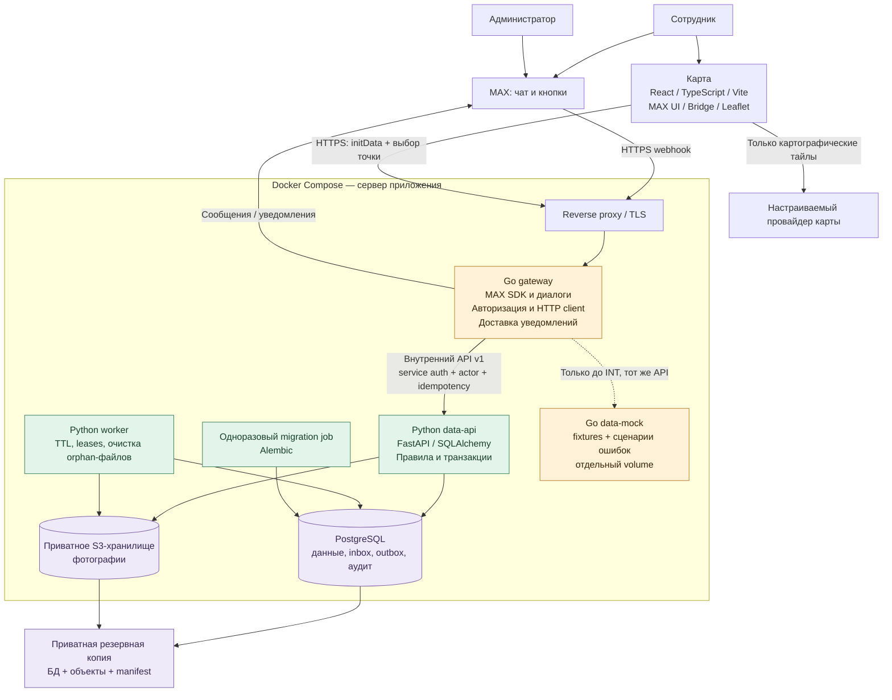

# Архитектура MAX Fleet

Версия проектного решения: 1.0, 26.09.2026. Реализация отсутствует. Источники: [README исходного репозитория](https://github.com/Seferaki/max-fleet/tree/e5c9caa5335ac5b3ceedaba42f323f388ad42d50), [продуктовая спецификация](../PRODUCT_SPEC.md) и уточнение заказчика: Go → Python API → PostgreSQL, интеграция после независимой разработки.

## 1. Компоненты



[SVG-копия](diagrams/architecture.svg). Пунктир — альтернативный режим разработки; mock и Python не обслуживают один поток бизнес-операций одновременно. Браузер не имеет доступа к PostgreSQL, S3 credentials или внутреннему API.

## 2. Границы ответственности

| Компонент | Делает | Вход / результат |
|---|---|---|
| Go gateway | Проверяет источник MAX; нормализует события; отображает сообщения и шаги; проверяет initData карты; скачивает фото с доверенного MAX-источника; передаёт бинарный поток Python; отправляет уведомления | MAX events / внешний HTTP → внутренний API; SQL отсутствует |
| Python API | Повторно проверяет actor/права/владение; выполняет правила, состояния, ограничения и транзакции; хранит прогресс, фото, аудит, inbox/outbox | Команды v1 → подтверждённое состояние |
| Python worker | Освобождает истёкшие оформления; возвращает просроченные leases в очередь; удаляет только неподвязанные файлы по политике | Те же сервисы домена и миграции; MAX token не нужен |
| PostgreSQL | Ограничения, долговечность, сериализация конфликтующих операций | Один владелец схемы — data engineer |
| S3 | Бинарные объекты; приватный bucket; приложение получает объекты по ключу | Python записывает/читает; публичного листинга нет |
| Карта | Отображает последнюю парковку, даёт выбрать точку, подтверждает отправку | initData + return_attempt_id + version + координаты |
| Go mock | Имитирует v1 для изолированной разработки Go и UI | Детерминированные fixtures и управляемые ошибки |

Python не является только набором SQL-запросов: он обеспечивает атомарность и бизнес-инварианты. Go не решает самостоятельно, можно ли выдать машину. Mock моделирует ответы и ограниченный сценарий; не становится второй production-реализацией правил.

## 3. Согласованные решения и рабочие допущения

| ID | Решение | Статус |
|---|---|---|
| ADR-01 | Go → HTTP Python → PostgreSQL; весь SQL, ORM и миграции в Python | Подтверждено заказчиком |
| ADR-02 | Два ноутбука по очереди ведут один backend-трек; data engineer работает отдельно; соединение в INT | Подтверждено заказчиком |
| ADR-03 | Главный интерфейс — чат; React/TS/Vite + MAX UI/Bridge сохраняются для карты | Совмещение спецификации и README |
| ADR-04 | FastAPI, SQLAlchemy 2, Alembic, psycopg; синхронная Session на запрос/операцию | Предложение для простого MVP; async не требуется |
| ADR-05 | Docker Compose на одном хосте; без Kubernetes, Kafka, Redis и распределённых транзакций в P0 | Предложение для размера автопарка |
| ADR-06 | Для локального S3 — SeaweedFS в одном контейнере с volume; библиотека boto3; адаптер не зависит от поставщика | Предложение; проверить фиксированный image/tag/digest в DE-01 |
| ADR-07 | Одна компания; 10 автомобилей; Europe/Moscow; 8 фото; hold 15 мин; пример 5 мин | Рабочие значения из исходной спецификации; часовой пояс уточняется в H-03 |
| ADR-08 | JPEG/PNG/WebP, до 10 MiB и 25 MP на изображение; описания до 1000 знаков, ориентир до 500 | Проектные ограничения, фиксируются в S-02 |
| ADR-09 | Реальные фото и история: автоматическое удаление выключено до решения владельца; orphan-файлы старше 24 ч удаляются только после проверки отсутствия ссылок | Политика пилота требует H-04 |
| ADR-10 | initData принимается не старше 1 часа, допустимое опережение часов 60 с; проверяется на каждом запросе карты | Проектное правило с учётом рекомендации MAX |

Версии Go/Python/Node/PostgreSQL и библиотек агент выбирает из поддерживаемых на старте S-03/DE-01 и фиксирует lock-файлами и image digest. Не обозначать произвольные версии как уже установленные. MinIO Community не выбран базовым образом: [его репозиторий архивирован](https://github.com/minio/minio). [SeaweedFS](https://github.com/seaweedfs/seaweedfs) поддерживает S3 и контейнерный запуск.

## 4. Обработка событий и восстановление

1. Go проверяет webhook secret, лимит тела, тип события и личный чат. Полученный client user_id не принимается как доказательство личности.
2. Go сохраняет нормализованное событие в Python inbox и получает durable acknowledgement. Только затем отвечает MAX 200. При недоступной БД — 503, без ложного подтверждения.
3. Go worker арендует очередное событие. Для одного actor события идут последовательно. Lease имеет срок; зависшее событие возвращается после сбоя. Версия бизнес-объекта защищает и от устаревшего порядка сообщений.
4. Go вызывает команду Python со стабильным idempotency key, actor и expected_version. Python в одной транзакции меняет домен, аудит, outbox и результат команды.
5. Go строит ответ из подтверждённого состояния. Если упал после commit, повтор команды возвращает прежний результат, бизнес-дубля нет.
6. Событие inbox помечается обработанным отдельно. Потеря acknowledgement безопасна из-за идемпотентности. Исходящие уведомления читаются из очереди delivery с lease и acknowledgement.
7. Внешнюю доставку сообщения невозможно честно назвать exactly-once: при успешной отправке и потерянном ответе MAX возможен дубль уведомления. Он не создаёт новую поездку.

MAX использует повторную доставку webhook; [его контракт](https://dev.max.ru/docs-api/methods/POST/subscriptions) задаёт HTTPS и заголовок `X-Max-Bot-Api-Secret`. Не выдумывать универсальное поле `update_id`: ключ нормализации берётся из доступного message/callback ID и типа; для остальных событий — стабильный fingerprint нормализованных полей, специфицированный в S-02.

## 5. Транзакции и фотографии

- Одна таблица `vehicle_assignments` хранит текущую занятость; уникальны и vehicle_id, и employee_id. Это закрывает гонку между отдельными таблицами оформлений и поездок.
- Бизнес-транзакции берут блокировки в одном порядке: сотрудники по UUID → машины по UUID → assignment → оформление/поездка → осмотр. Все пути, включая админские, следуют этому порядку.
- Срок hold проверяется сервером при каждой команде; worker нужен для уборки, но остановленный worker не продлевает право начать поездку.
- На старте и возврате проверяются данные, а состояние, время, снимок машины, аудит и outbox фиксируются одной транзакцией.
- Загрузка в S3 выполняется до короткой финальной транзакции БД. После проверки размера/типа и SHA-256 Python сохраняет объект, проверяет успешность записи, затем привязывает к ракурсу. До этой привязки фото не засчитывается.
- БД и S3 не имеют общей транзакции: при сбое БД возможен orphan-объект; его удаляет worker. При сбое S3 осмотр остаётся неполным. Замена фото атомарно меняет только один ракурс.
- Завершённые осмотры неизменяемы. Админские исправления — новый audit record и, когда нужно, новая парковка/снимок, без перезаписи исторического доказательства.

## 6. Безопасность и эксплуатационные пределы

Внешние запросы приходят только в Go. Python проверяет service secret и actor; caller role не доверяется, роль читается из БД. Внутренний service secret никогда не попадает в браузер. Сеть Compose не публикует порты PostgreSQL, S3 и data-api. Production readiness запрещает mock и тестовый обход авторизации.

Предыдущий осмотр доступен сотруднику как отдельная обезличенная проекция машины: без имени предыдущего водителя, его истории, комментариев и произвольного доступа по asset_id. Доступ к собственным фото, админский просмотр и обезличенная проекция проверяются отдельно.

Целевая проверка MVP: 50 одновременных пользователей, 20 JSON API rps за 10 минут на указанном в отчёте стенде, p95 ≤ 500 мс без сетевого времени MAX/S3, доля неожиданных 5xx < 1%, ноль двойных закреплений. 10 параллельных фото по 5 MiB проверяются отдельно. Это критерий проверки, не обещание достигнутой производительности. Outgoing MAX ограничивается отдельно с backoff на 429; текущий лимит уточняется по [официальному API](https://dev.max.ru/docs-api).

Liveness проверяет процесс; readiness — конфигурацию, БД, миграции и storage. Ограничить DB pool, HTTP timeouts, длину очереди и размеры файлов. При перегрузке возвращать понятный retryable отказ, не терять черновик. Подробности — [DATA_ENGINEER](DATA_ENGINEER.md) и [OPERATIONS](OPERATIONS.md).

## 7. Целевая структура кода

```text
services/gateway/       Go: cmd/gateway, cmd/data-mock, internal/max, dialogs, dataapi
services/data/          Python: app/api, domain, repositories, storage, workers, migrations
web/                   React: только карта и подтверждение парковки
contracts/             OpenAPI v1, enum/schema, синтетические примеры, fixtures
deploy/                Compose, proxy, конфигурация контейнеров
scripts/               bootstrap, verify, backup/restore, smoke (PS1 и sh)
tests/acceptance/       общие контрактные сценарии и интеграционные проверки
docs/progress/         единственный текущий статус каждого направления
```

Это проектируемые каталоги; они появятся по плану. Не создавать пустые сервисы ради видимости готовности.
