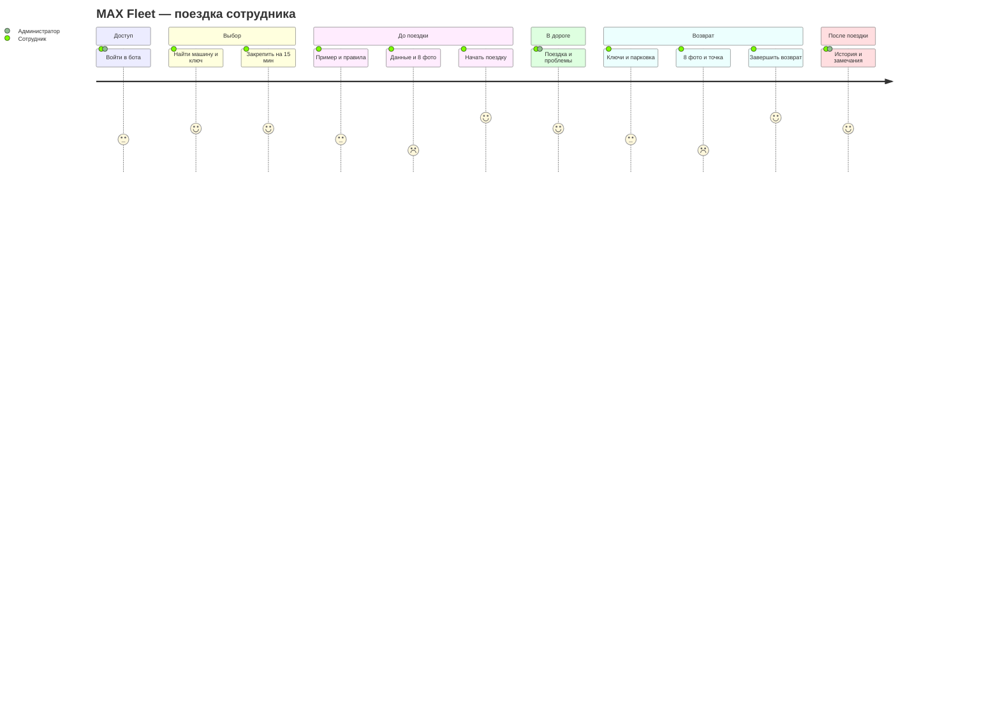

# CJM — путь сотрудника и администратора

Цель сотрудника: получить подходящую машину и корректно вернуть её без потери прогресса. Цель администратора: видеть занятость, место последнего возврата и замечания. Основа — [PRODUCT_SPEC](../PRODUCT_SPEC.md); это проектируемый опыт, а не результаты пользовательского исследования.

[SVG-копия](diagrams/cjm.svg). Оценки 1–5 — гипотеза о предполагаемом удобстве, а не измеренный CSAT. Самые трудоёмкие места — фото и возврат; QA и демонстрация должны проверить их первыми.

| Этап / цель | Действие и контакт | Возможная трудность | Ответ продукта | Действие администратора / критерий |
|---|---|---|---|---|
| Войти | Личный чат, /start | Нет доступа | Показать только собственный MAX ID и инструкцию обращения | Добавить ID; AC-01 |
| Выбрать машину | Список → карточка → карта/ключи | Машину заняли; место неизвестно | Свежая проверка при подтверждении; не публиковать машину без места и инструкции ключей | Подготовить данные; AC-02…AC-04 |
| Закрепить | Намерение → подтверждение | Два сотрудника нажали одновременно | Один hold, понятный отказ второму; срок 15 минут | При блокировке отменить hold; AC-03, AC-11 |
| Пройти допуск | Пример и версия правил | Ошибка, старая кнопка | 4 варианта; новый пример после 3 ошибок или 5 минут; прогресс сохранён | Не считать проверку доказательством трезвости; AC-05 |
| Осмотреть | Топливо, одометр, 8 ракурсов | Не тот файл, 7 фото, дубликат, медленная сеть | Счётчик после сохранения, назвать недостающий ракурс, заменить один снимок | Новое замечание отменяет выдачу и блокирует машину; AC-06…AC-09 |
| Начать | Проверить сводку → итоговая кнопка | Ответ потерян | Повтор показать результат одной поездки; не объявлять успех до commit | Уведомление после сохранения; AC-10, AC-20 |
| Пользоваться | Текущая поездка, проблема, контакт | Неисправность; доступ отозван | Сохранить возможность возврата и обращения; следующую выдачу заблокировать | Разобрать замечание; AC-22, AC-25 |
| Вернуть | Анкета, 8 фото | Повреждение; ключи потеряны | С повреждением можно вернуть и заблокировать выдачу; без ключей/безопасной парковки нужен ответственный | Не требовать ложного «всё исправно»; AC-17, AC-18 |
| Указать место | MAX geo или ручной маркер | GPS запрещён, карта не загрузилась | Ручной выбор доступен сразу; не принимать центр карты автоматически | При отказе обоих способов сохранить черновик; AC-13…AC-15 |
| Закончить | Итоговое подтверждение | Сбой БД; повтор клика | Атомарное завершение или сохранённый черновик; автомобиль занят до успеха | Получить уведомление; AC-16, AC-20, AC-24 |
| Проверить историю | Свои поездки / админская история | Чужие данные; незаполненный аварийный возврат | Только разрешённые данные; пометка неполноты | Аварийно закрыть с причиной и новой проверкой; AC-21, AC-23 |

## Прерывания, которые не должны заставлять начинать всё заново

- /menu, закрытие чата, перезапуск контейнера: продолжить текущий шаг и использовать уже сохранённые фотографии.
- Истечение hold: попытка остаётся в истории, машина освобождается при отсутствии запретов; новая попытка требует новых фото.
- Возврат → «Вернуться к поездке»: поездка продолжается; следующий черновик возврата требует новых фото и точки.
- Ошибка загрузки фото/координат: показать отсутствие подтверждения, предложить повтор; не увеличивать счётчик и не отмечать сохранение заранее.
- Админская аварийная операция: явная причина и неполнота в истории; машину обязательно проверить перед новой выдачей.

После первой демонстрации измерить: долю законченных оформлений, время до начала, время возврата, число повторных загрузок и долю ручного выбора карты. Целевые значения утверждать по реальным наблюдениям, не выдавать предполагаемые оценки за метрики.
