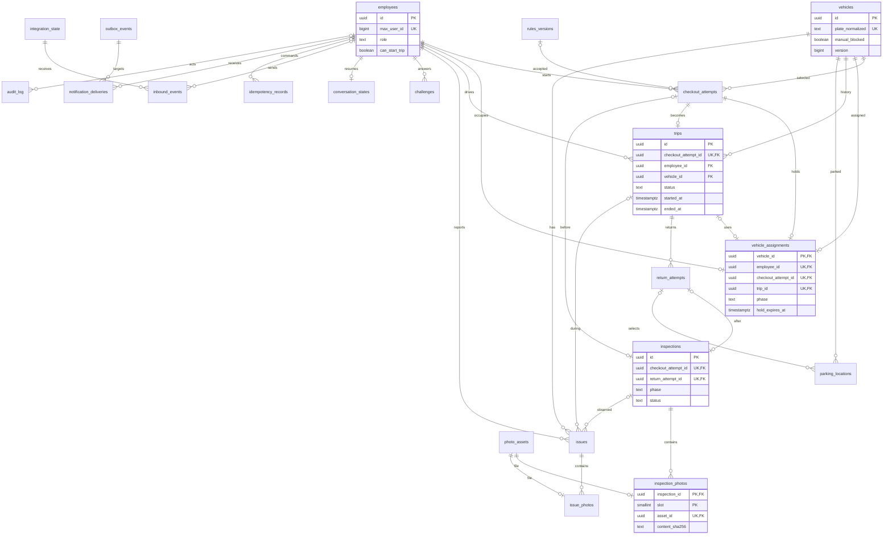

# База данных — задание на таблицы и ограничения

Версия модели 1.0, 26.09.2026. Владелец: data engineer. Это спецификация будущих Alembic-миграций, **не уже созданная БД**. Весь SQL исполняет Python. Связанные документы: [контракт](API_CONTRACT.md), [задание data engineer](DATA_ENGINEER.md), [план DE](IMPLEMENTATION_PLAN.md).

## 1. ER-диаграмма

[SVG-копия](diagrams/database.svg). Диаграмма показывает все 21 таблицу и основные связи. Вспомогательные ссылки автора, текущего снимка машины, выбранной парковки и причин уточнены ниже, чтобы схема оставалась читаемой. Полиморфные ссылки аудита/событий проверяются приложением.

## 2. Общие соглашения

- `id uuid PRIMARY KEY` у каждой таблицы, кроме явно указанного составного/естественного PK. UUID генерирует сервер; MAX ID не является внутренним PK.
- Поля без `?` — `NOT NULL`; `?` означает nullable. У всех сущностей с изменяемым состоянием: `created_at timestamptz`, `updated_at timestamptz`, `version bigint DEFAULT 1 CHECK(version>0)`. В append-only таблицах только `created_at`.
- Время — серверное UTC; в ответе RFC3339, в UI — часовой пояс компании. Сравнение TTL использует часы БД. Пробег — целые км `bigint CHECK(value>=0)`; топливо — `smallint CHECK(value IN (0,25,50,75,100))`.
- FK: `ON DELETE RESTRICT`, кроме отдельно обоснованных технических очисток. Пользователи, машины, поездки и осмотры не удаляются пользовательским CRUD. Ни одного cascade от сотрудника к истории.
- Статусы: `text + CHECK` для простых миграций. JSONB только для контекстов, схемы событий и аудита; ключевые связи/состояния/фильтры — обычные колонки.
- Во внешнем JSON UUID, MAX user ID и chat ID — строки; не терять 64-битную точность в JavaScript. Пустые значения — null, не `0`, пустая координата или фиктивная фотография.
- Каждая FK, используемая в поиске, получает индекс. Для списков использовать (created_at,id) или (started_at,id), cursor pagination; максимум 50 записей, UI по 5.

## 3. Справочники, доступ и текущая занятость

### 3.1. employees

| Поля | Назначение / ограничения |
|---|---|
| id, max_user_id bigint UNIQUE, display_name text | Внутренний ID, проверенный MAX ID, ФИО; имя 1–200 знаков |
| role text | employee / admin; выдаётся bootstrap/оператором, не через обычный пользовательский API |
| can_start_trip boolean DEFAULT true | Блокировка запрещает новые оформления, сохраняет возврат своей активной поездки |
| access_block_reason text?, access_changed_by uuid? FK employees | Причина и автор; при блокировке причина обязательна |
| max_chat_id bigint?, bot_started_at timestamptz? | Канал доставки после первого диалога; не считать сам факт ID разрешением на уведомления |
| created_at, updated_at, version | Оптимистическая версия админского редактирования |

Индексы: unique(max_user_id), (role,can_start_trip). Администратор может иметь can_start_trip=false и сохранять административные полномочия.

### 3.2. vehicles

| Поля | Назначение / ограничения |
|---|---|
| id, plate text, plate_normalized text UNIQUE, make text, model text | Госномер хранить и отображать без потери исходного написания; нормализацию определить в fixtures |
| description text, key_instructions text | По умолчанию пустая строка; без непустой key_instructions выдача недоступна |
| manual_blocked boolean DEFAULT false, block_reason text?, blocked_by uuid? FK employees | Независимый запрет выдачи; причина обязательна при true |
| needs_review boolean DEFAULT false | Аварийное закрытие требует отдельной проверки; снять можно только отдельной операцией с причиной |
| current_parking_location_id uuid? FK parking_locations | Последняя подтверждённая парковка, не live GPS |
| current_fuel smallint?, fuel_confirmed_at timestamptz? | Значение и его актуальность |
| current_odometer_km bigint?, odometer_confirmed_at timestamptz? | Значение и его актуальность |
| last_inspection_id uuid? FK inspections | Последний принятый осмотр; не путать с последним завершённым возвратом |
| created_at, updated_at, version | Для stale-button защиты |

Текущий odometer snapshot — подтверждённый порог для ввода на выезде и возврате. При active hold/trip администратор может скорректировать только snapshot одометра: Python блокирует vehicle и точную assignment в одной транзакции, пишет автора/причину/старое и новое значение в audit, не меняя inspection, фото и assignment. До коррекции порог совпадает с before-inspection; после неё сравнения используют новый snapshot, а исторический before-inspection остаётся неизменным.

Доступность **вычисляется**: нет assignment, manual_blocked=false, needs_review=false, нет блокирующего issue, есть парковка и инструкция ключей. Состояния интерфейса: trip → «В поездке», hold → «Оформляется», иначе блок/неполная карточка → «Недоступен», иначе «Доступен». Запрет следующей выдачи виден отдельно при поездке.

### 3.3. rules_versions

Поля: id; `version_label text UNIQUE`; `body text`; `body_sha256 char(64)`; `effective_at timestamptz`; `is_current boolean`; created_at. Индекс unique на `is_current WHERE is_current=true` даёт максимум одну текущую версию. У принятой версии текст не меняется; публикуется новая запись. Оформление хранит конкретную версию и время принятия.

### 3.4. checkout_attempts

Поля: id; `employee_id FK employees`; `vehicle_id FK vehicles`; `status text` (holding/started/cancelled/expired/rejected); `step text`; `expires_at timestamptz`; `intent_confirmed_at?`; `rules_version_id? FK rules_versions`; `rules_accepted_at?`; `no_new_issues boolean?`; `ended_at?`; `end_reason text?`; created_at/updated_at/version.

Правила: expires_at = created_at + 15 минут; время не продлевается навигацией и фото. rules_version_id и rules_accepted_at либо оба null, либо оба заполнены. Индексы: (employee_id,created_at,id), (vehicle_id,created_at,id), (expires_at) WHERE status='holding'. Начатая поездка ссылается на попытку; отменённая попытка хранит свой осмотр.

### 3.5. vehicle_assignments — единая защита от двойной выдачи

Поля: `vehicle_id uuid PRIMARY KEY FK vehicles`; `employee_id uuid NOT NULL UNIQUE FK employees`; `checkout_attempt_id uuid NOT NULL UNIQUE FK checkout_attempts`; `trip_id uuid? UNIQUE FK trips`; `phase text` (hold/trip); `hold_expires_at timestamptz?`; created_at/updated_at/version.

`CHECK`: hold требует trip_id=null и hold_expires_at!=null; trip требует trip_id!=null и hold_expires_at=null. При начале поездки обновляется **та же строка**, без освобождения машины между hold и trip. При штатном/аварийном завершении строка удаляется в транзакции.

Не пытаться заменить эту таблицу двумя независимыми partial unique индексами в checkout_attempts и trips: они не запрещают одновременно hold и trip на одного человека. Не применять `now()` в predicate индекса для истечения срока.

## 4. Поездка, осмотры и место

### 4.1. trips

Поля: id; `checkout_attempt_id UNIQUE FK checkout_attempts`; `employee_id FK employees`; `vehicle_id FK vehicles`; `status text` (active/returning/completed/closed_by_admin); `started_at`; `ended_at?`; `closed_by uuid? FK employees`; `close_reason text?`; `missing_data jsonb DEFAULT '[]'`; created_at/updated_at/version.

CHECK: active/returning → ended_at=null; completed/closed_by_admin → ended_at>=started_at; closed_by_admin требует closed_by и непустую close_reason. missing_data — массив имён реально отсутствующих полей, не замена данным. Partial unique(vehicle_id) и partial unique(employee_id) WHERE status IN ('active','returning') — дополнительная страховка. Индексы истории: (employee_id,started_at DESC,id), (vehicle_id,started_at DESC,id).

### 4.2. return_attempts

Поля: id; `trip_id FK trips`; `status text` (draft/cancelled/completed/admin_closed); `step text`; `intent_confirmed_at?`; `parking_location_id uuid? FK parking_locations`; `cancelled_at?`; `completed_at?`; created_at/updated_at/version. Partial unique(trip_id) WHERE status='draft'.

Один trip может иметь несколько отменённых возвратов, но только один текущий черновик. При «Вернуться к поездке» статус cancelled; следующий возврат создаёт новый ID, осмотр и парковку, не копируя старые данные. У возврата нет автоматического TTL, который освобождает машину.

### 4.3. inspections

| Поля | Ограничения |
|---|---|
| id, phase text, status text | phase=before/after; status=draft/finalized/abandoned |
| checkout_attempt_id uuid? UNIQUE FK, return_attempt_id uuid? UNIQUE FK | before → только checkout; after → только return; ровно одна ссылка обязательна |
| author_id uuid FK employees | Пользователь, предоставивший данные |
| fuel_level smallint?, odometer_km bigint? | Обязательны для finalized; в draft допустимы null |
| new_damage boolean?, cabin_clean boolean?, parking_allowed boolean?, keys_returned boolean?, car_locked boolean? | Для after все ответы обязательны; false не превращать автоматически в true |
| photos_confirmed_at timestamptz?, attested_at timestamptz?, finalized_at timestamptz? | Подтверждение 8 ракурсов, итоговое подтверждение сотрудником и фиксация |
| created_at, updated_at, version | Замена фото сбрасывает photos_confirmed_at и attested_at |

Связь с поездкой выводится через checkout_attempts → trips либо return_attempts → trips; дублирующий trip_id не нужен. Ровно 8 ракурсов при finalized проверяет сервис в той же транзакции с блокировкой осмотра; обычный CHECK не умеет считать строки другой таблицы. Закрытый осмотр запрещено менять через доменный сервис; роли БД исключают обход через публичный API.

### 4.4. parking_locations

Поля: id; `vehicle_id FK vehicles`; `return_attempt_id uuid? FK return_attempts`; `latitude numeric(9,6)` [-90,90]; `longitude numeric(9,6)` [-180,180]; `source text` (max_geo/manual_map/admin/seed); `landmark text?` до 500; `address text?`; `author_id uuid? FK employees`; `confirmed_at timestamptz`; created_at.

Каждое подтверждение создаёт неизменяемую запись. Оформление выбирает одну из собственных точек через parking_location_id. Рабочая точка автомобиля обновляется только при завершении возврата или отдельной админской коррекции свободной машины. source=seed допускает author_id=null; остальные требуют автора. Для admin/seed return_attempt_id=null. Индекс (vehicle_id,confirmed_at DESC).

Для available_data аварийного закрытия использовать существующий либо новый return_attempt со status=admin_closed и неполный after inspection со status=abandoned. Имеющиеся подтверждённые сведения сохраняются с автором операции в audit; неполный осмотр не объявляется finalized и не заменяет обычный последний after-осмотр. Если администратор задаёт точку, создать source=admin и явно отразить её источник. needs_review остаётся true до отдельного решения. Поля available_data фиксируются типизированной схемой в S-02.

## 5. Фотографии и замечания

### 5.1. photo_assets

Поля: id; `object_key text UNIQUE`; `bucket text`; `sha256 char(64)`; `mime_type text`; `size_bytes bigint CHECK(>0)`; `width integer CHECK(>0)`; `height integer CHECK(>0)`; `uploaded_by uuid FK employees`; `source_event_key text?`; `state text` (staged/ready/delete_pending/deleted); `stored_at timestamptz?`; `deleted_at?`; created_at/updated_at/version.

Размер ограничить 10 MiB, площадь 25 MP. sha256 не глобально unique: один файл может законно встречаться в разных попытках, хотя внутри одного осмотра его нельзя выдать за разные ракурсы. UNIQUE(id,sha256) нужен для составной FK из inspection_photos. Object key случайный, без ФИО, номера машины и адреса. Хранится ключ объекта, не временный подписанный URL MAX/S3.

Для загрузок до создания замечания дополнительно нужны `purpose text` (inspection/issue), `scope_type text`, `scope_id uuid`, `staging_expires_at timestamptz?`. Scope ссылается на разрешённый inspection/trip/vehicle и проверяется Python; привязать asset может только его actor в том же контексте. Сохранённый stage-объект не считается фото осмотра до привязки.

При issue.create сохранённые stage assets переводятся в ready одновременно с привязками issue_photos. stored_at заполнено уже после S3-записи; staged отличается от несохранённого файла. Нельзя чистить referenced объект даже после истечения staging_expires_at.

### 5.2. inspection_photos

PK: `(inspection_id uuid FK inspections, slot smallint CHECK 1..8)`; `asset_id uuid UNIQUE FK photo_assets`; `content_sha256 char(64)`; `attached_by uuid FK employees`; `attached_at timestamptz`; `source_event_key text`.

UNIQUE(inspection_id,content_sha256); FK(asset_id,content_sha256) → photo_assets(id,sha256). Слоты: 1 front, 2 rear, 3 left, 4 right, 5 cabin_front, 6 cabin_rear, 7 trunk, 8 dashboard. При замене меняется одна строка с audit record старого/new asset_id. Старый объект остаётся до политики очистки; финализированный осмотр менять нельзя.

### 5.3. issues

Поля: id; `vehicle_id FK vehicles`; `author_id FK employees`; `trip_id uuid? FK trips`; `inspection_id uuid? FK inspections`; `stage text` (before/during/return/after); `category text` (body_damage/mechanical/cleanliness/keys/other); `description text` 1–1000; `status text` (open/in_progress/resolved/known_nonblocking); `blocks_issuance boolean DEFAULT true`; `resolution_comment text?`; `resolved_by uuid? FK employees`; `resolved_at?`; created_at/updated_at/version.

Resolved/known_nonblocking требуют автора, комментария и времени; blocks_issuance=false. Open/in_progress всегда блокируют новую выдачу. Все переходы пишутся в аудит; первоначальное сообщение не перезаписывается решением. Python проверяет, что trip/inspection принадлежат той же машине. Индексы: (vehicle_id,status,created_at), (status,created_at), (trip_id).

### 5.4. issue_photos

PK: `(issue_id uuid FK issues, ordinal smallint CHECK 1..3)`; `asset_id uuid UNIQUE FK photo_assets`; `attached_at timestamptz`. Под блокировкой issue добавлять максимум три фото. Они не увеличивают число обязательных фото осмотра. Одну asset-запись нельзя связать одновременно с issue_photos и inspection_photos: сервис проверяет назначение; при необходимости одна физическая картинка получает отдельные логические assets.

## 6. Прогресс, подтверждения и надёжность

### 6.1. challenges

Поля: id; `actor_id FK employees`; `purpose text` (take/return/vehicle_block/vehicle_unblock/employee_access/admin_close); `target_type text`; `target_id uuid?`; `target_version bigint?`; `intent_payload jsonb`; `intent_sha256 char(64)`; `operand_a smallint` 1..9; `operand_b smallint` 1..9; `options jsonb` ровно 4 различных числа; `correct_answer smallint`; `wrong_attempts smallint` 0..3; `expires_at`; `solved_at?`; `consumed_at?`; `invalidated_at?`; created_at/updated_at/version.

Ответ не сериализовать клиенту. Подпись намерения покрывает операцию, объект, версию и критические параметры. target_id полиморфный, поэтому связь проверяется выбранным доменным обработчиком; произвольное имя SQL-таблицы из запроса не использовать. Для нового сотрудника payload хранит целевой MAX ID, а target_id может быть null. После правильного ответа take/return одноразово записывают intent_confirmed_at в оформление; итоговая кнопка того же оформления не требует второго примера. Индекс (actor_id,purpose,expires_at).

### 6.2. conversation_states

PK: `employee_id uuid FK employees`; `chat_id bigint`; `flow text`; `step text`; `context jsonb` с типизированными ID; `pending_input_kind text?`; created_at/updated_at/version.

Это навигационный курсор, не источник истины о поездке. /menu не отменяет бизнес-объект. Сохранять state через compare-and-swap version. При расхождении восстановить шаг по актуальному checkout/trip/return и не продвигать случайное фото в следующий ракурс.

### 6.3. integration_state

PK: `integration_key text` (например max:primary); `mode text` (webhook/polling); `poll_marker text?`; `poller_lease_owner text?`; `poller_lease_until timestamptz?`; created_at/updated_at/version. Секретов здесь нет. Единственный poller. Marker сохранять после durable записи всех событий пачки и только потом использовать при следующем запросе MAX.

### 6.4. inbound_events

Поля: id; `integration_key FK integration_state`; `event_key text`; `event_type text`; `actor_id uuid? FK employees`; `actor_max_user_id bigint`; `payload jsonb`; `payload_schema_version integer`; `received_at`; `status text` (pending/processing/done/dead); `attempt_count integer`; `lease_owner text?`; `lease_until?`; `next_attempt_at`; `last_error_code text?`; created_at/updated_at/version.

UNIQUE(integration_key,event_key), индекс очереди (status,next_attempt_at,received_at). Actor может отсутствовать в employees до выдачи доступа. Не хранить весь HTTP-запрос: только минимальный нормализованный payload; временную ссылку на фото, если нужна для обработки, защищать как секрет, не логировать и удалять по TTL. Порядок обработки — по actor_max_user_id; crash lease не должен давать двум worker одновременно менять диалог.

### 6.5. idempotency_records

Поля: id; `scope text` (service + actor + operation); `key text`; `request_sha256 char(64)`; `actor_id uuid? FK employees`; `status text` (processing/completed); `http_status integer?`; `response_json jsonb?`; `resource_type text?`; `resource_id uuid?`; `expires_at timestamptz`; created_at/updated_at/version.

UNIQUE(scope,key). Результат записывается в **той же транзакции**, что и бизнес-операция. Повтор того же key с другим body → 409 IDEMPOTENCY_CONFLICT. Совпадающий запрос возвращает сохранённый результат, без повторного побочного эффекта. Проверка авторизации выполняется и при повторе; отзыв доступа не должен открыть чужие данные из кэша.

Проектный TTL — 7 суток для технического cache; уникальные связи checkout→trip и терминальные состояния сохраняют защиту бизнес-операций после очистки. Истёкшая/неизвестная старая callback-команда не создаёт новую попытку автоматически.

### 6.6. outbox_events

Поля: id; `event_type text`; `aggregate_type text`; `aggregate_id uuid`; `aggregate_version bigint`; `payload jsonb`; `schema_version integer DEFAULT 1`; `occurred_at`; `expanded_at?`; created_at.

UNIQUE(event_type,aggregate_type,aggregate_id,aggregate_version). События: trip.started, trip.completed, issue.created, vehicle.blocked, employee.access_changed, trip.admin_closed. Создание outbox входит в доменную транзакцию. Минимальный payload содержит ссылки/снимок для согласованного уведомления без секретов.

### 6.7. notification_deliveries

Поля: id; `event_id FK outbox_events`; `recipient_id FK employees`; `channel text DEFAULT 'max'`; `status text` (pending/sending/sent/retry/dead); `attempt_count integer DEFAULT 0`; `next_attempt_at`; `lease_owner text?`; `lease_until?`; `sent_at?`; `provider_message_id text?`; `last_error_code text?`; created_at/updated_at/version.

UNIQUE(event_id,recipient_id,channel), индекс (status,next_attempt_at). Получателей материализовать идемпотентно в транзакции; outbox.expanded_at выставить после создания всех строк. Перед отправкой снова проверять допустимость получателя. Для недоступного/заблокировавшего бота — dead с причиной и видимостью в диагностике; поездка не откатывается.

### 6.8. audit_log

Поля: id; `actor_id uuid? FK employees`; `actor_kind text` (employee/admin/system); `action text`; `entity_type text`; `entity_id uuid`; `reason text?`; `before_json jsonb?`; `after_json jsonb?`; `request_id uuid`; created_at.

Append-only, без секретов и бинарных фото. Для административных исправлений обязательна причина. Индексы (entity_type,entity_id,created_at,id), (actor_id,created_at). Полиморфная связь допускается только здесь и в явно описанных event/command-контекстах. Retention аудита согласуется отдельно; очистка не выполняется обычным API.

## 7. Порядок миграций и защита инвариантов

1. employees, rules_versions, vehicles без snapshot FK; integration_state.
2. checkout_attempts, trips, return_attempts без parking FK; inspections.
3. parking_locations, photo_assets, inspection_photos, issues, issue_photos.
4. vehicle_assignments, challenges, conversation_states, inbox/idempotency/outbox/delivery/audit.
5. Добавить отложенные FK vehicles → parking/inspection и return_attempts → parking; индексы, CHECK и права сервисной роли.
6. Синтетический seed отдельной идемпотентной командой; bootstrap реального администратора отдельной командой, не публичной миграцией.

Циклические FK return↔parking и snapshot машины добавляются после таблиц, не требуют отключать FK при штатной работе. Сначала создать return с parking=null, затем parking с return_id, затем указатель в return.

| Транзакция | Что блокировать и проверять | Что фиксировать вместе |
|---|---|---|
| Создать hold | Employee → vehicle → assignments; доступ, отсутствие активного hold/trip, готовность карточки, отсутствие запретов | attempt + assignment + audit + idempotent result |
| Начать trip | Те же строки + attempt/inspection; TTL, правила, intent, 8 ready фото, fuel/odo, отсутствие новых проблем | trip + attempt.started + assignment.phase=trip + finalized inspection + snapshot + outbox + audit |
| До выезда найден issue | Employee → vehicle → assignment/attempt | issue + отмена hold + abandoned inspection + освобождение assignment + outbox + audit |
| Начать/отменить return | Employee → vehicle → assignment/trip | новый return и after inspection / отмена черновика, состояние trip; assignment остаётся |
| Завершить return | Employee → vehicle → assignment/trip → return/inspection; 8 фото, intent, анкета, точка, ограничения ключей/парковки, odo | trip.completed + finalized inspection + snapshot машины + release assignment + outbox + audit |
| Аварийно закрыть | Блокировки владельца поездки и администратора в стабильном порядке; права, intent, причина | closed_by_admin + missing_data + needs_review=true + release assignment + outbox + audit |
| Блокировать/разблокировать | Затронутые employee/vehicle/assignment; причина и intent; открытые issues | Флаг, при hold отмена; активная trip сохраняется; audit/outbox |

Нельзя держать row lock во время скачивания фото, HTTP MAX или загрузки S3. Если сначала нужно определить владельца по trip_id, прочитать ID без lock, затем взять блокировки в стандартном порядке и повторно проверить связи.

## 8. Обязательные проверки data engineer

- На реальном PostgreSQL 20 одновременных запросов одной машины от разных сотрудников дают ровно один assignment; один сотрудник на 20 машин также получает один.
- Начало одновременно с TTL-expiry/блокировкой: либо одна корректная поездка, либо отказ; нет промежуточно свободной машины.
- Дубликат команды, обрыв ответа после commit, повтор после restart: один trip, один итог возврата, один outbox event.
- Финализация с 7 фото, повтор sha256 в разных слотах, 9-й слот и фото issue вместо осмотра отклоняются.
- Сбой S3 не даёт ready фото; сбой БД после записи S3 даёт orphan без потери ранее принятого снимка.
- Закрытая история неизменна; исправления и аварийный возврат видны в audit; чужие фото недоступны.
- Миграции проходят на пустой БД и на копии предыдущей схемы; backup/restore проверяет и строки, и доступность объектов.

Рекомендации по row locks — [PostgreSQL](https://www.postgresql.org/docs/current/explicit-locking.html). Конкретные SQL/DDL и тесты создаются в DE-02…DE-09; этот документ не заменяет проверенные миграции.
